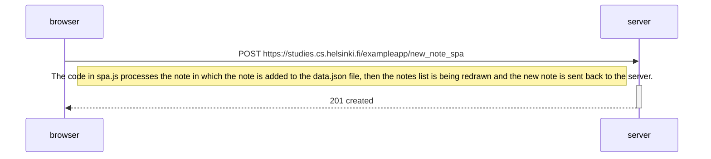

```mermaid
sequenceDiagram
    participant browser
    participant server

    browser->>server: POST https://studies.cs.helsinki.fi/exampleapp/new_note_spa
    Note right of browser: The code in spa.js processes the note in which the note is added to the data.json file, then the notes list is being redrawn and the new note is sent back to the server.
    activate server
    server-->>browser: 201 created
    deactivate server

```